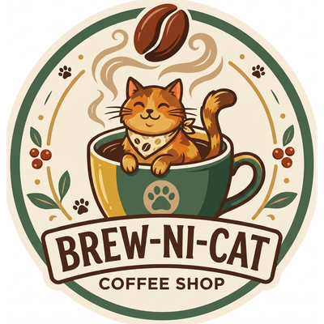

# Brew-Ni-Cat Coffee Shop POS

<p align="center">
  
</p>

## 📖 Project Overview

**Brew-Ni-Cat Coffee Shop POS** is a fully-featured, offline-first Android Point-of-Sale (POS) application tailored specifically for a cozy, cat-themed coffee shop. Built with modern Android development standards, it provides a robust system for managing menus, executing orders, tracking real-time inventory through dynamic recipes, and generating end-of-day financial reports—all without requiring an active internet connection.

---

## ✨ Key Features

### 🛒 Point of Sale & Checkout
* **Grid-Based Menu System:** Intuitive, touch-friendly UI for selecting items categorized by food and drinks.
* **Variant & Flavor Selection:** Support for complex item structures (e.g., Small/Medium/Large variants and custom flavors like Vanilla/Caramel).
* **Split Payments:** Seamlessly handle payments split between Cash and GCash (Digital Wallet).
* **Smart Change Calculator:** Automatically calculates and suggests change for cash transactions based on the amount tendered.
* **Quick Discounts:** Built-in 5% discount toggle for loyal customers or promotional use.

### 📦 Dynamic Inventory & Recipe Engine
* **Raw Material Tracking:** Track underlying raw ingredients (e.g., Coffee Beans, Milk, Syrups) rather than just final products.
* **Bill of Materials (BOM):** Link custom raw materials to specific menu variants. Selling a "Large Vanilla Latte" automatically deducts the exact amount of beans, milk, and vanilla syrup from the inventory.
* **Low Stock Alerts:** Visual indicators for items running low or out of stock, preventing orders that cannot be fulfilled.

### 📊 Business Goals & Analytics (Z-Reading)
* **Customizable Targets:** Set daily sales goals (Target Sales) and a starting cash float directly within the app.
* **Progress Tracking:** Dynamic visual progress bars showing Total Sales vs. Target Sales, and the breakdown of payment modes (Cash vs. GCash).
* **End-of-Day Reports:** Generate comprehensive Z-Readings detailing Gross Sales, Expenses, and Net Profits (Cash Flow).
* **Hardware Printing:** Built-in ESC/POS service to directly print professional customer receipts to compatible Bluetooth thermal printers.
* **Shareable Receipts:** Export text-based receipts to Messenger, Email, or Notes.

---

## 🛠 Tech Stack & Architecture

This application leverages modern Android development practices and libraries:

* **Language:** Kotlin
* **UI Toolkit:** Jetpack Compose (Material 3)
* **Local Database:** Room (SQLite) with Coroutines support
* **Architecture:** MVVM (Model-View-ViewModel) + Repository Pattern
* **Concurrency:** Kotlin Coroutines & StateFlow
* **Hardware Integration:** Android Bluetooth API for ESC/POS Thermal Printing

### Project Structure
* **`data/`**: Contains Room Database definitions, DAOs (Data Access Objects), Entities, and the Repository implementations.
* **`domain/`**: Houses the core business logic, including Use Cases for calculating totals, inventory deduction logic, and the core Models.
* **`ui/`**: Contains all Jetpack Compose screens, separated by feature (Dashboard, History/Z-Reading, Inventory) and their respective ViewModels.

---

## 🚀 Setup & Installation

### Prerequisites
* Android Studio (Latest Stable Version)
* Android SDK 26 (Android 8.0 Oreo) or higher
* A physical Android device is recommended for testing Bluetooth printing functionality.

### Build Instructions
1. **Clone the repository:**
   ```bash
   git clone https://github.com/RodneeGlenMartin/Brew-ni-Cat-POS.git
   ```
2. **Open the project:**
   Launch Android Studio and select **File > Open**, then navigate to the cloned directory.
3. **Sync Gradle:**
   Allow Android Studio to download the necessary dependencies and sync the Gradle files.
4. **Run the App:**
   Connect your Android device or start an emulator. Click the **Run** button (`Shift + F10`) to compile and install the application.

---

## 🖨 Bluetooth Printer Setup
To utilize the receipt printing feature:
1. Ensure your thermal printer supports the standard **ESC/POS** protocol.
2. Pair the printer with your Android device via the system Bluetooth settings.
3. Once paired, the app will automatically attempt to discover and connect to the paired printer when the "Print Receipt" button is tapped.

---

## 📜 License

MIT License

Copyright (c) 2026 Brew-Ni-Cat Coffee Shop

Permission is hereby granted, free of charge, to any person obtaining a copy
of this software and associated documentation files (the "Software"), to deal
in the Software without restriction, including without limitation the rights
to use, copy, modify, merge, publish, distribute, sublicense, and/or sell
copies of the Software, and to permit persons to whom the Software is
furnished to do so, subject to the following conditions:

The above copyright notice and this permission notice shall be included in all
copies or substantial portions of the Software.

THE SOFTWARE IS PROVIDED "AS IS", WITHOUT WARRANTY OF ANY KIND, EXPRESS OR
IMPLIED, INCLUDING BUT NOT LIMITED TO THE WARRANTIES OF MERCHANTABILITY,
FITNESS FOR A PARTICULAR PURPOSE AND NONINFRINGEMENT. IN NO EVENT SHALL THE
AUTHORS OR COPYRIGHT HOLDERS BE LIABLE FOR ANY CLAIM, DAMAGES OR OTHER
LIABILITY, WHETHER IN AN ACTION OF CONTRACT, TORT OR OTHERWISE, ARISING FROM,
OUT OF OR IN CONNECTION WITH THE SOFTWARE OR THE USE OR OTHER DEALINGS IN THE
SOFTWARE.
